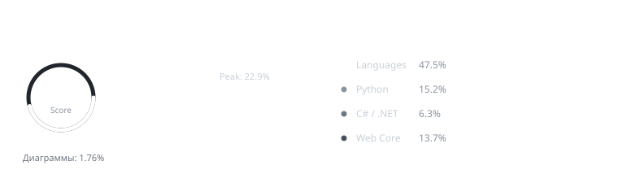

  

    

  

    
    &nbsp;&nbsp;
    
    &nbsp;&nbsp;
    
  

    &nbsp;&nbsp;&nbsp;&nbsp;
  

   

  

    <b>🛠 Стек технологий</b>
  

  

     

  

    <b>📊 Активность на GitHub</b>
  

  

